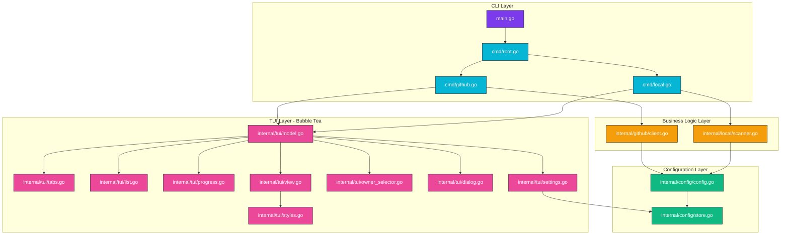
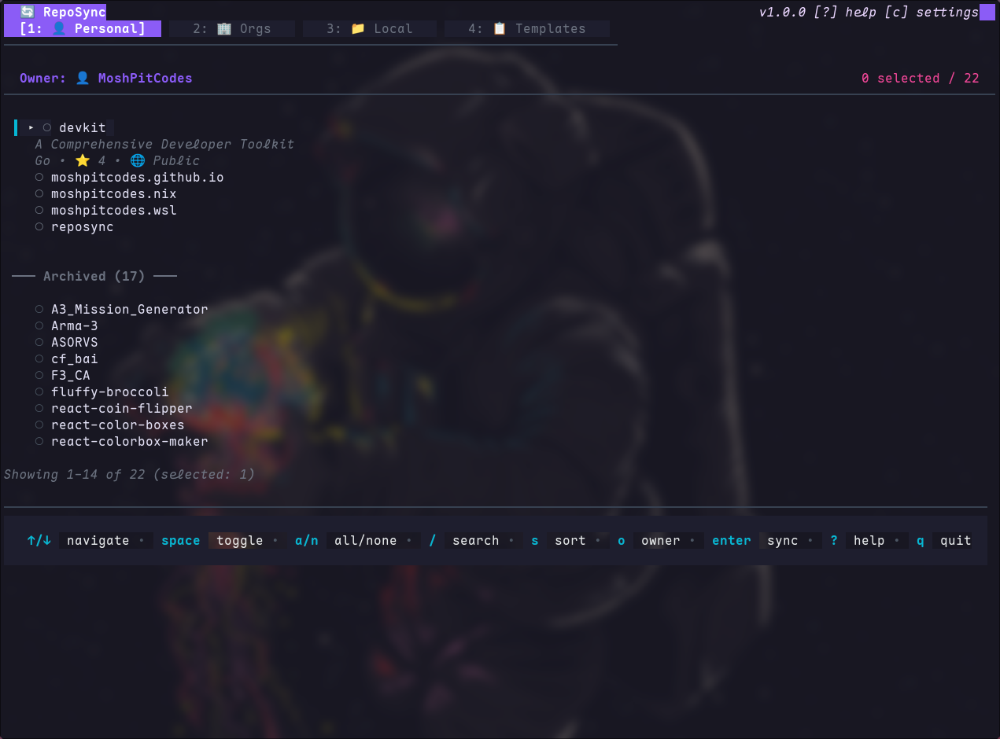
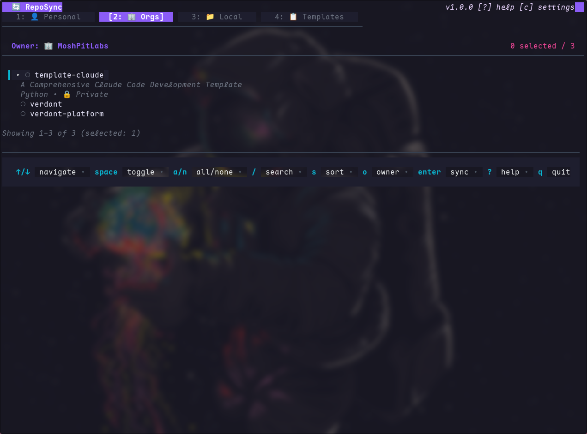
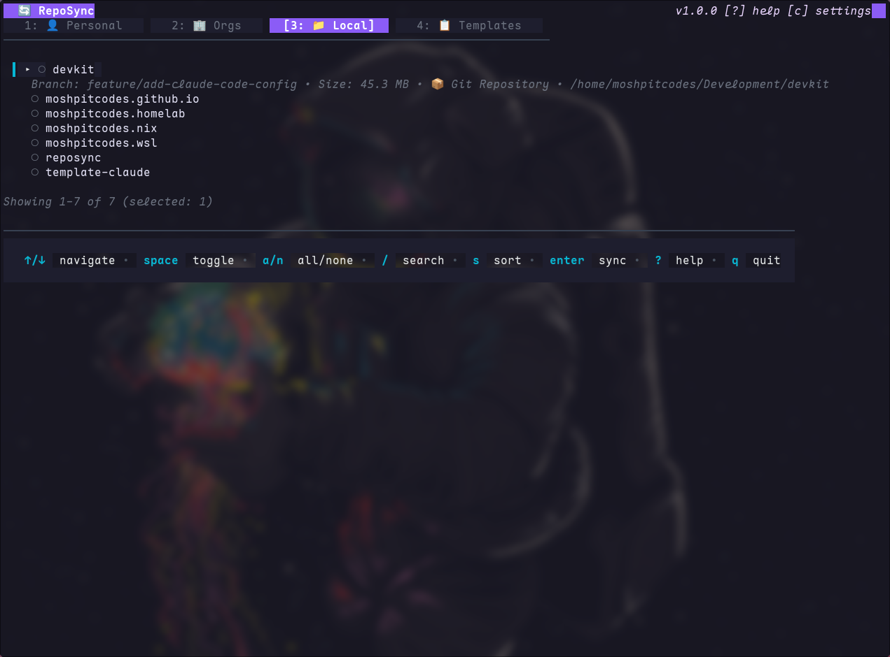
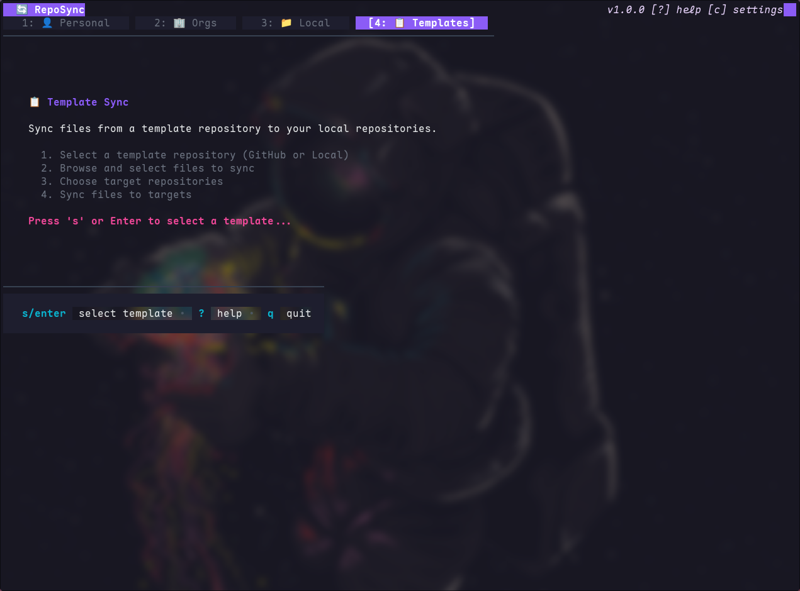

<!-- DO NOT TOUCH THIS SECTION#1: START -->
<h1 align="center">
   <br>
      reposync | Repository Synchronization Tool with Interactive TUI
   <br>

   <div align="center">
      <div align="center">
         <a href="https://github.com/MoshPitCodes/reposync/stargazers">
            
         </a>
         <a href="https://github.com/MoshPitCodes/reposync/">
            
         </a>
         <a href="https://github.com/MoshPitCodes/reposync/blob/main/LICENSE">
            
         </a>
         <a href="https://go.dev/">
            
         </a>
      </div>
      <br>
   </div>
</h1>

<br/>
<!-- DO NOT TOUCH THIS SECTION#1: END -->

# 🗃️ Overview

`reposync` is a Go CLI/TUI for synchronizing repositories into a target workspace. It can clone from GitHub, copy local repositories, and sync selected template files across multiple local repositories.

Built with Bubble Tea, it supports both interactive workflows (tabbed TUI) and batch workflows (CLI flags) for automation.

### Key Features

- **Interactive TUI** - 4-tab interface: Personal, Organizations, Local, Templates
- **GitHub Integration** - Uses `gh` for authentication and repository operations
- **Local Repository Discovery** - Scans configured source directories for Git repositories
- **Template Sync Workflow** - Select template source/files and sync to many local repos
- **Batch Mode** - Non-interactive mode for GitHub clone and local copy operations
- **Persistent Configuration** - Settings stored in `~/.config/reposync/config.json`
- **Conflict Handling** - Repository/file conflict detection with safe defaults
- **Progress Tracking** - Inline progress for sync operations
- **Keyboard-Driven** - Comprehensive keyboard shortcuts for all actions
- **Idiomatic Go** - Built with Go 1.25+

<br/>

## 📚 Project Structure

[`cmd/`](cmd/) - CLI command definitions and entry points

[`internal/config/`](internal/config/) - Configuration management with persistent storage to `~/.config/reposync/config.json`

[`internal/github/`](internal/github/) - GitHub API client implementation using [go-gh](https://github.com/cli/go-gh)

[`internal/local/`](internal/local/) - Local filesystem scanner for discovering Git repositories

[`internal/template/`](internal/template/) - Template file synchronization engine

[`internal/tui/`](internal/tui/) - Bubble Tea TUI components including models, views, tabs, lists, progress bars, settings, owner selector, and dialogs

[`main.go`](main.go) - Application entry point

<br/>

## 📓 Project Components

| Component                      | Responsibility                                                                                           |
| ------------------------------ | :------------------------------------------------------------------------------------------------------- |
| **CLI Commands**               | Root command with TUI launcher, GitHub subcommand (interactive/batch), Local subcommand (interactive/batch) |
| **Configuration Management**   | Environment variable handling, persistent storage (`~/.config/reposync/config.json`), settings UI      |
| **GitHub Integration**         | API client using go-gh, repository listing, organization management, authentication via GitHub CLI      |
| **Local Scanner**              | Filesystem scanning for Git repositories, directory traversal, repository metadata extraction           |
| **TUI Framework**              | Bubble Tea model/view architecture, tab navigation, repository list view, multi-select functionality    |
| **TUI Components**             | Progress tracking, settings/help overlays, owner selector, conflict dialogs, keyboard shortcuts          |
| **Template Sync Engine**       | Sync selected files from GitHub/local template sources to multiple local repositories                   |
| **Synchronization Engine**     | Git clone operations, local repository copying, conflict detection, progress reporting                  |

<br/>

# 📐 Architecture



### Detailed Structure

```
reposync/
├── cmd/
│   ├── root.go           # Root command and TUI launcher with tab support
│   ├── github.go         # GitHub subcommand (batch/interactive)
│   └── local.go          # Local subcommand (batch/interactive)
├── internal/
│   ├── config/
│   │   ├── config.go     # Configuration management and environment variables
│   │   └── store.go      # Persistent config storage (~/.config/reposync/config.json)
│   ├── github/
│   │   └── client.go     # GitHub API client (via go-gh)
│   ├── local/
│   │   └── scanner.go    # Local filesystem scanner for Git repositories
│   ├── template/
│   │   └── sync.go       # Template sync engine and conflict handling
│   └── tui/
│       ├── model.go      # Main Bubble Tea model (state management)
│       ├── view.go       # View rendering logic
│       ├── tabs.go       # Tab bar (Personal/Organizations/Local/Templates)
│       ├── list.go       # Repository list view with selection
│       ├── progress.go   # Inline progress tracking during sync
│       ├── settings.go   # Settings overlay (config editor)
│       ├── owner_selector.go  # GitHub owner/org selector
│       ├── dialog.go     # Repository exists conflict dialog
│       ├── messages.go   # Bubble Tea messages (events)
│       ├── keymap.go     # Keyboard shortcuts and bindings
│       └── styles.go     # Lipgloss styles (colors, formatting)
├── main.go               # Application entry point
├── go.mod                # Go module definition
└── README.md             # This file
```

<br/>

# 🚀 **Installation**

> [!CAUTION]
> `reposync` can clone/copy many repositories into your target directory. Review configuration first and back up important data before large sync operations.

> [!WARNING]
> Install and authenticate GitHub CLI (`gh auth login`) before using GitHub-based workflows.

<br/>

## 1. **Prerequisites**

Before installing reposync, ensure you have the following dependencies:

- **Go 1.25 or later** - [Download](https://go.dev/dl/)
- **Git** - Version control system
- **GitHub CLI (`gh`)** - Required for TUI startup and GitHub-based operations (`gh auth login`)
- Authenticated GitHub account (for Personal/Organizations/Template-from-GitHub flows)

> [!NOTE]
> This tool has been tested with the following parameters:
> - Go 1.25+ on Linux, macOS, and Windows
> - GitHub CLI v2.40.0+
> - Git 2.40.0+

<br/>

## 2. **Installation Methods**

### Using Go Install (Recommended)

```bash
go install github.com/MoshPitCodes/reposync@latest
```

This installs the `reposync` binary into your `$GOPATH/bin`.

### Build from Source

```bash
# Clone the repository
git clone https://github.com/MoshPitCodes/reposync.git
cd reposync

# Build the binary
go build -o reposync

# Install globally (optional)
go install
```

## 3. **Configuration**

> [!TIP]
> You can configure reposync using environment variables, or interactively by pressing `c` in the TUI to open the settings panel.

### Environment Variables

Configure `reposync` using the following environment variables:

| Variable | Description | Default |
|----------|-------------|---------|
| `REPOSYNC_TARGET_DIR` | Target directory for cloning/copying repositories | `~/repos` |
| `REPOSYNC_GITHUB_OWNER` | Default GitHub owner/organization | Current user |
| `REPOSYNC_SOURCE_DIRS` | Colon-separated list of directories to scan for local repos | None |

### Example Configuration

Add to your `~/.bashrc`, `~/.zshrc`, or equivalent:

```bash
# Target directory for synchronized repositories
export REPOSYNC_TARGET_DIR="$HOME/projects"

# Default GitHub owner/organization
export REPOSYNC_GITHUB_OWNER="MoshPitCodes"

# Directories to scan for local repositories (colon-separated)
export REPOSYNC_SOURCE_DIRS="$HOME/dev:$HOME/work:$HOME/personal"
```

### Persistent Configuration

Settings are persisted to `~/.config/reposync/config.json` and include:

- Target directory for synchronized repositories
- Source directories for local repository scanning
- Default GitHub owner
- Recent owners and templates (for quick switching)

<br/>

# 📝 **Usage**

## Quick Start

### Interactive Mode

Launch the interactive TUI menu with tabbed interface:

```bash
reposync
```

This opens a 4-tab interface:
- **Personal (Tab 1)** - Browse your personal GitHub repositories
- **Organizations (Tab 2)** - Browse organization repositories
- **Local (Tab 3)** - Browse local Git repositories from configured directories
- **Templates (Tab 4)** - Select a template source/files and sync into local repositories

### GitHub Mode

Sync repositories from GitHub interactively:

```bash
# Launch GitHub mode
reposync github

# Launch with specific owner/organization
reposync github --owner MoshPitCodes
```

Batch mode to clone specific repositories:

```bash
reposync github --owner MoshPitCodes --batch repo1 repo2 repo3
```

`reposync github` requires an owner from one of:
- `--owner`
- `REPOSYNC_GITHUB_OWNER`
- persisted settings (`Default Owner` in the settings overlay)

### Local Mode

Sync local repositories interactively:

```bash
reposync local
```

Batch mode to copy specific repositories:

```bash
reposync local --batch /path/to/repo1 /path/to/repo2
```

<br/>

## Command Reference

```bash
reposync                                         # Launch interactive TUI with tabs
reposync github                                  # GitHub interactive mode (requires owner config)
reposync github --owner <owner>                  # GitHub mode with specific owner
reposync github --owner <owner> --batch <repos...>  # Batch clone repos
reposync local                                   # Local interactive mode
reposync local --batch <paths...>                # Batch copy repos
```

<br/>

## Interactive Features

<details>
<summary>
<b>Tab Navigation</b> - Switch between Personal, Organizations, Local, and Templates modes
</summary>

- **Personal (1)**: View your personal GitHub repositories
- **Organizations (2)**: View organization repositories (use `o` to switch owners)
- **Local (3)**: View local repositories from configured directories
- **Templates (4)**: Select template source/files and sync into target repos
- **Switch Tabs**: Press `1`, `2`, `3`, or `4` to jump directly, or use `tab`/`shift+tab` to cycle

</details>

<details>
<summary>
<b>Repository List View</b> - Navigate, filter, and sync repositories
</summary>

- **Navigation**: `↑`/`↓` or `k`/`j`; use `pgup`/`pgdown` for paging
- **Selection**: Press `space` to toggle selection of individual repositories
- **Select All**: Press `a` to select all repositories in the current list
- **Deselect All**: Press `n` to deselect all repositories
- **Search**: Press `/` for real-time filtering
- **Sort**: Press `s` to cycle sort modes (name, updated, stars, size)
- **Owner**: Press `o` to open the owner selector (GitHub modes only)
- **Settings**: Press `c` to open configuration settings
- **Help**: Press `?` to view all keyboard shortcuts
- **Sync**: Press `enter` to start synchronization of selected repositories
- **Quit**: Press `q` or `ctrl+c` to exit

</details>

<details>
<summary>
<b>Search and Filter</b> - Real-time repository filtering
</summary>

- Type to filter repositories by name; filtering updates immediately
- Press `enter` or `esc` to exit search mode
- Search works across all tabs (Personal, Organizations, Local)

</details>

<details>
<summary>
<b>Template Workflow</b> - Multi-step template file sync
</summary>

- In **Templates** tab, press `s` or `enter` to open the template selector
- Select source: GitHub (`owner/repo`) or local directory
- Choose template files from the tree (`space` to toggle)
- Select target local repositories and run sync
- Review result summary (synced/skipped/errors)

</details>

<br/>

## Examples

### Browse and Clone GitHub Repositories

```bash
# Launch the TUI
reposync

# In the TUI:
# 1. Press '1' (Personal) or '2' (Organizations)
# 2. Press 'o' to switch owner if needed
# 3. Select repos with 'space'
# 4. Optional: '/' to filter, 's' to sort
# 5. Press 'enter' to clone selected repositories
```

### Batch Clone Specific Repositories

```bash
# Clone multiple repositories from a specific owner
reposync github --owner MoshPitCodes --batch \
  reposync \
  moshpitcodes.template \
  moshpitcodes.nixos
```

### Discover and Copy Local Repositories

```bash
# Configure source directories (or set via Settings with 'c' in TUI)
export REPOSYNC_SOURCE_DIRS="$HOME/dev:$HOME/projects"

# Launch the TUI
reposync

# In the TUI:
# 1. Press '3' for Local tab
# 2. Select repositories with 'space'
# 3. Press 'enter' to copy to target directory
```

### Batch Copy Local Repositories

```bash
# Copy specific local repositories to target directory
reposync local --batch \
  /home/user/dev/project1 \
  /home/user/dev/project2 \
  /home/user/work/project3
```

<br/>

# 🖼️ Gallery

### Personal Repositories (Tab 1)
Browse and sync your personal GitHub repositories with detailed metadata display.

<p align="center">
   
</p>

### Organization Repositories (Tab 2)
Switch between organizations and browse their repositories with the owner selector.

<p align="center">
   
</p>

### Local Repositories (Tab 3)
Discover and sync local Git repositories from your configured directories.

<p align="center">
   
</p>

### Template Sync (Tab 4)
Sync files from a template repository to multiple local repositories at once.

<p align="center">
   
</p>

<br/>

# 👥 Credits

Built with the following excellent libraries:

- [Bubble Tea](https://github.com/charmbracelet/bubbletea): Terminal UI framework based on The Elm Architecture
- [Bubbles](https://github.com/charmbracelet/bubbles): Reusable TUI components for Bubble Tea
- [Lipgloss](https://github.com/charmbracelet/lipgloss): Style definitions and rendering for terminal UIs
- [go-gh](https://github.com/cli/go-gh): Official GitHub CLI library for Go
- [Cobra](https://github.com/spf13/cobra): Modern CLI framework for Go

Special thanks to:

- [Charm](https://charm.sh/): For creating the amazing Bubble Tea ecosystem
- [GitHub CLI Team](https://cli.github.com/): For the official Go library

Other resources and inspiration:

- [The Elm Architecture](https://guide.elm-lang.org/architecture/): Architectural pattern used in Bubble Tea
- [Conventional Commits](https://www.conventionalcommits.org/): Commit message convention

<br/>

<!-- DO NOT TOUCH THIS SECTION#2: START -->
<!-- # ✨ Stars History -->

<br/>

<p align="center"></p>

<br/>

<p align="center"></p>

<!-- end of page, send back to the top -->

<div align="right">
  <a href="#readme">Back to the Top</a>
</div>
<!-- DO NOT TOUCH THIS SECTION#2: END -->
