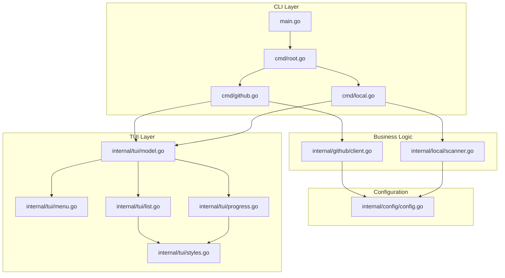

<h1 align="center">
   repo-sync
   <br>
   Repository Synchronization Tool with Interactive TUI
</h1>

<div align="center">
   <p>A powerful CLI tool for synchronizing repositories from GitHub or local sources with an interactive terminal UI powered by Bubble Tea</p>

   <div align="center">
      <a href="https://github.com/MoshPitCodes/moshpitcodes.reposync/stargazers">
         
      </a>
      <a href="https://github.com/MoshPitCodes/moshpitcodes.reposync/">
         
      </a>
      <a href="https://github.com/MoshPitCodes/moshpitcodes.reposync/blob/main/LICENSE">
         
      </a>
      <a href="https://go.dev/">
         
      </a>
   </div>
</div>

## Overview

`repo-sync` is a modern Go CLI application that simplifies repository management by providing an elegant, interactive terminal user interface for synchronizing repositories. Built with Bubble Tea, it offers both interactive and batch modes for maximum flexibility.

### Key Features

- **Interactive TUI** - Beautiful terminal UI with multi-select, search, and filtering
- **GitHub Integration** - Seamless integration with GitHub via the `gh` CLI
- **Local Repository Discovery** - Automatically scans configured directories for Git repositories
- **Batch Mode** - Non-interactive mode for automation and scripting
- **Progress Tracking** - Real-time progress with spinners and status updates
- **Configurable** - Environment variable configuration for paths and defaults
- **Idiomatic Go** - Built following Go 1.24+ best practices and patterns

## Installation

### Prerequisites

- Go 1.24 or later
- Git
- GitHub CLI (`gh`) - for GitHub synchronization
- Authenticated GitHub account (run `gh auth login`)

### Build from Source

```bash
# Clone the repository
git clone https://github.com/MoshPitCodes/moshpitcodes.reposync.git
cd moshpitcodes.reposync

# Build the binary
go build -o repo-sync

# Install globally (optional)
go install
```

### Using Go Install

```bash
go install github.com/MoshPitCodes/moshpitcodes.reposync@latest
```

## Quick Start

### Interactive Mode

Launch the interactive TUI menu:

```bash
repo-sync
```

This presents a menu with the following options:
- **Sync from GitHub** - Browse and select GitHub repositories
- **Sync from Local** - Browse local Git repositories
- **Exit**

### GitHub Mode

Sync repositories from GitHub interactively:

```bash
repo-sync github --owner MoshPitCodes
```

Or use batch mode to clone specific repositories:

```bash
repo-sync github --owner MoshPitCodes --batch repo1 repo2 repo3
```

### Local Mode

Sync local repositories interactively:

```bash
repo-sync local
```

Or use batch mode to copy specific repositories:

```bash
repo-sync local --batch /path/to/repo1 /path/to/repo2
```

## Configuration

Configure `repo-sync` using environment variables:

| Variable | Description | Default |
|----------|-------------|---------|
| `REPO_SYNC_TARGET_DIR` | Target directory for cloning/copying repositories | `~/repos` |
| `REPO_SYNC_GITHUB_OWNER` | Default GitHub owner/organization | None |
| `REPO_SYNC_SOURCE_DIRS` | Colon-separated list of directories to scan for local repos | None |

### Example Configuration

```bash
# Add to ~/.bashrc or ~/.zshrc
export REPO_SYNC_TARGET_DIR="$HOME/projects"
export REPO_SYNC_GITHUB_OWNER="MoshPitCodes"
export REPO_SYNC_SOURCE_DIRS="$HOME/dev:$HOME/work:$HOME/personal"
```

## Usage

### Command Reference

```
repo-sync                                    # Launch interactive TUI menu
repo-sync github                             # GitHub interactive mode
repo-sync github --owner <owner>             # Specify GitHub owner
repo-sync github --owner <owner> --batch <repos...>  # Batch clone
repo-sync local                              # Local interactive mode
repo-sync local --batch <paths...>           # Batch copy
```

### Interactive Features

#### Repository List View

- **Navigation**: Use `↑`/`↓` or `k`/`j` to navigate
- **Selection**: Press `space` to toggle selection
- **Select All**: Press `a` to select all repositories
- **Deselect All**: Press `n` to deselect all
- **Search**: Press `/` to enter search mode
- **Sync**: Press `enter` to start synchronization
- **Back**: Press `q` or `esc` to return to menu

#### Search Mode

- Type to filter repositories in real-time
- Press `enter` to exit search and keep filter
- Press `esc` to cancel search and show all

### Examples

#### Clone Multiple GitHub Repositories Interactively

```bash
# Set default owner
export REPO_SYNC_GITHUB_OWNER="MoshPitCodes"

# Launch GitHub mode
repo-sync github

# In the TUI:
# 1. Use arrow keys to navigate
# 2. Press 'space' to select repositories
# 3. Press '/' to search
# 4. Press 'enter' to clone
```

#### Batch Clone Specific Repositories

```bash
repo-sync github --owner MoshPitCodes --batch \
  moshpitcodes.reposync \
  moshpitcodes.template \
  moshpitcodes.nixos
```

#### Discover and Copy Local Repositories

```bash
# Configure source directories
export REPO_SYNC_SOURCE_DIRS="$HOME/dev:$HOME/projects"

# Launch local mode
repo-sync local

# Select repositories and press enter to copy
```

## Architecture



### Project Structure

```
moshpitcodes.reposync/
├── cmd/
│   ├── root.go       # Root command and interactive menu launcher
│   ├── github.go     # GitHub subcommand
│   └── local.go      # Local subcommand
├── internal/
│   ├── config/
│   │   └── config.go # Configuration management
│   ├── github/
│   │   └── client.go # GitHub API client (via go-gh)
│   ├── local/
│   │   └── scanner.go # Local filesystem scanner
│   └── tui/
│       ├── model.go   # Main Bubble Tea model
│       ├── menu.go    # Main menu view
│       ├── list.go    # Repository list view
│       ├── progress.go # Progress view
│       └── styles.go  # Lipgloss styles
├── main.go           # Application entry point
├── go.mod            # Go module definition
└── README.md         # This file
```

## Technology Stack

- **Language**: Go 1.24+
- **TUI Framework**: [Bubble Tea v2](https://github.com/charmbracelet/bubbletea)
- **UI Components**: [Bubbles](https://github.com/charmbracelet/bubbles)
- **Styling**: [Lipgloss](https://github.com/charmbracelet/lipgloss)
- **GitHub API**: [go-gh](https://github.com/cli/go-gh)
- **CLI Framework**: [Cobra](https://github.com/spf13/cobra)

## Development

### Building

```bash
# Build for current platform
go build -o repo-sync

# Build with version info
go build -ldflags "-X main.version=1.0.0" -o repo-sync

# Build for multiple platforms
GOOS=linux GOARCH=amd64 go build -o repo-sync-linux-amd64
GOOS=darwin GOARCH=amd64 go build -o repo-sync-darwin-amd64
GOOS=windows GOARCH=amd64 go build -o repo-sync-windows-amd64.exe
```

### Testing

```bash
# Run tests
go test ./...

# Run tests with coverage
go test -cover ./...

# Run tests with race detection
go test -race ./...
```

### Code Quality

```bash
# Format code
gofmt -w .
goimports -w .

# Lint code
golangci-lint run

# Vet code
go vet ./...
```

## Contributing

Contributions are welcome! Please follow these guidelines:

1. Fork the repository
2. Create a feature branch (`git checkout -b feature/amazing-feature`)
3. Commit your changes using conventional commits
4. Push to the branch (`git push origin feature/amazing-feature`)
5. Open a Pull Request

### Conventional Commits

We use conventional commits for clear commit history:

- `feat:` - New features
- `fix:` - Bug fixes
- `docs:` - Documentation changes
- `refactor:` - Code refactoring
- `test:` - Test updates
- `chore:` - Maintenance tasks

## License

This project is licensed under the Apache License 2.0 - see the [LICENSE](LICENSE) file for details.

## Credits

Built with:

- [Bubble Tea](https://github.com/charmbracelet/bubbletea) - Terminal UI framework
- [Bubbles](https://github.com/charmbracelet/bubbles) - TUI components
- [Lipgloss](https://github.com/charmbracelet/lipgloss) - Style definitions
- [go-gh](https://github.com/cli/go-gh) - GitHub API client
- [Cobra](https://github.com/spf13/cobra) - CLI framework

## Support

- Report bugs via [GitHub Issues](https://github.com/MoshPitCodes/moshpitcodes.reposync/issues)
- Ask questions in [GitHub Discussions](https://github.com/MoshPitCodes/moshpitcodes.reposync/discussions)

---

<div align="center">
   Made with ❤️ by <a href="https://github.com/MoshPitCodes">MoshPitCodes</a>
</div>
