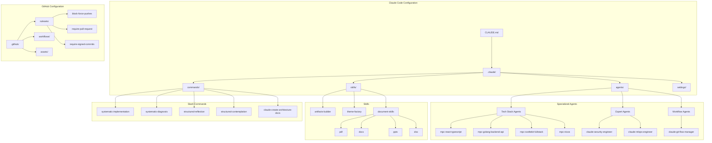
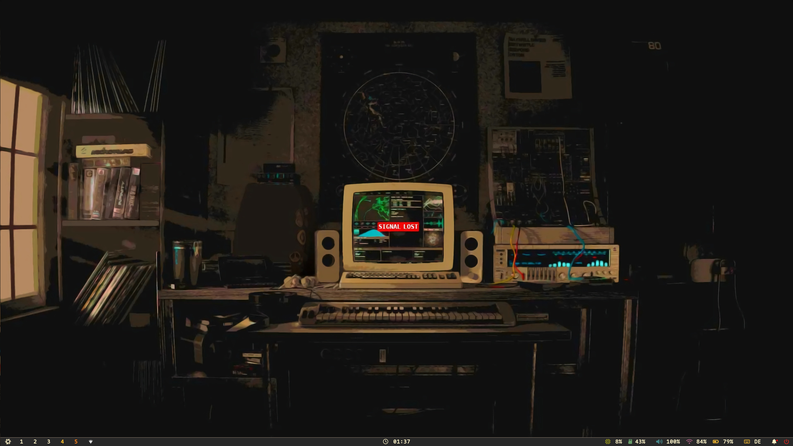
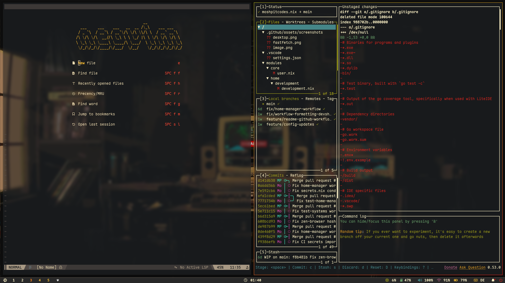
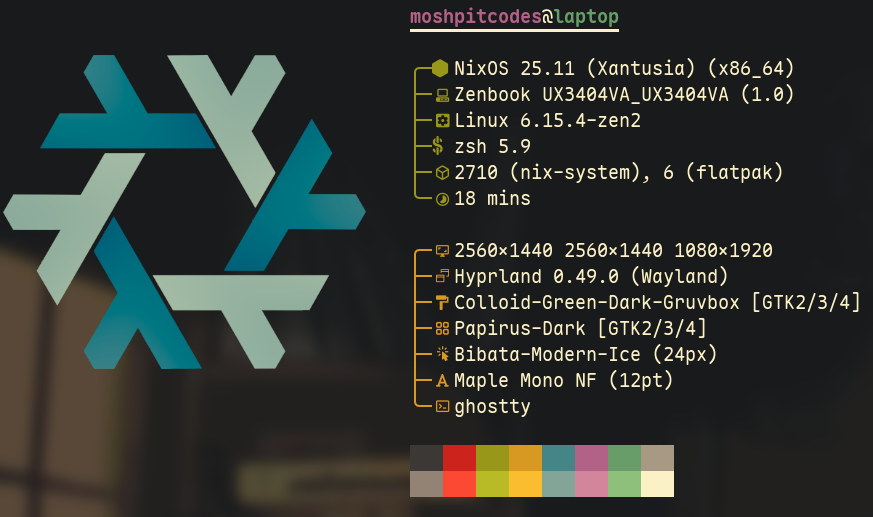

<!-- DO NOT TOUCH THIS SECTION#1: START -->
<h1 align="center">
   
   <br>
      moshpitcodes.template | A Comprehensive Claude Code Development Template
   <br>
       <br>

   <div align="center">
      <p></p>
      <div align="center">
         <a href="https://github.com/MoshPitCodes/moshpitcodes.template/stargazers">
            
         </a>
         <a href="https://github.com/MoshPitCodes/moshpitcodes.template/">
            
         </a>
         <a href="https://github.com/MoshPitCodes/moshpitcodes.template/blob/main/LICENSE">
            
         </a>
      </div>
      <br>
   </div>
</h1>

<br/>
<!-- DO NOT TOUCH THIS SECTION#1: END -->

# Overview

A comprehensive Claude Code template repository featuring pre-configured AI development standards, specialized agents, reusable skills, and project automation. This template provides a solid foundation for new projects with established best practices for AI-assisted development workflows, including:

- **18 Specialized Agents** for different tech stacks and use cases
- **7 Slash Commands** for systematic development workflows
- **5 Skills** with document processing capabilities (PDF, DOCX, PPTX, XLSX)
- **5 GitHub Rulesets** for branch protection and code quality
- **VSCode Configurations** for consistent development environments

<br/>

## Project Structure

```
moshpitcodes.template/
├── .claude/                    # Claude Code Configuration Root
│   ├── agents/                 # 18 Specialized AI Agents
│   │   ├── mpc-*               # Tech stack agents (8)
│   │   └── claude-*            # Expert/workflow agents (10)
│   ├── commands/               # 7 Slash Commands
│   │   ├── systematic-*        # Systematic workflows
│   │   └── structured-*        # Thinking frameworks
│   ├── skills/                 # Reusable Skills
│   │   ├── artifacts-builder/  # React/Tailwind artifact toolkit
│   │   ├── theme-factory/      # 10 professional themes
│   │   ├── mcp-builder/        # MCP server creation
│   │   ├── skill-creator/      # Custom skill creation
│   │   └── document-skills/    # PDF, DOCX, PPTX, XLSX processing
│   └── settings/               # Environment configurations
├── .github/
│   ├── rulesets/               # Branch protection rules (5)
│   ├── assets/                 # Logo, pallet, screenshots
│   └── workflows/              # GitHub Actions
├── .vscode/                    # VSCode workspace settings
├── CLAUDE.md                   # Development standards
└── docs/                       # Documentation templates
```

<br/>

## Project Components

| Component | Responsibility |
| --------- | :------------- |
| **Specialized Agents** | 18 pre-configured AI agents for different tech stacks (Go, React, SvelteKit, NixOS, DevOps, Security, MLOps, etc.) |
| **Document Skills** | PDF, DOCX, PPTX, and XLSX manipulation capabilities with scripts and templates |
| **Slash Commands** | Systematic workflows for implementation, diagnosis, reflection, and architecture documentation |
| **Theme Factory** | 10 pre-set professional themes for styling artifacts and presentations |
| **Artifacts Builder** | React + Tailwind CSS + shadcn/ui artifact creation toolkit |
| **GitHub Rulesets** | Branch protection, signed commits, pull request requirements, and linear history enforcement |
| **Git Flow Manager** | Automated Git Flow workflow management with conventional commits |

<br/>

# Architecture



<br/>

# Getting Started

> [!CAUTION]
> This template contains pre-configured AI agent behaviors and development standards. Review and customize these configurations to match your team's requirements before using in production projects.

> [!WARNING]
> You **must** review the agent configurations and slash commands to ensure they align with your specific development workflows.

<br/>

## 1. **Prerequisites**

Before using this template, ensure you have:

- [Claude Code CLI](https://docs.anthropic.com/claude-code) installed
- Git configured with signed commits (recommended)
- GitHub CLI (`gh`) for pull request management
- Node.js 18+ (for document skills and artifacts)
- Python 3.10+ (for PDF/DOCX processing scripts)

<br/>

## 2. **Use This Template**

Click the "Use this template" button on GitHub to create a new repository, then clone it:

```bash
git clone https://github.com/YOUR_USERNAME/YOUR_REPO_NAME
cd YOUR_REPO_NAME
```

> [!NOTE]
> This template includes pre-configured Claude Code settings. Initialize Claude Code in your project to activate them:
> ```bash
> claude code init
> ```

<br/>

## 3. **Customize for Your Project**

> [!TIP]
> Review the available agents and skills to understand what capabilities are available before customizing.

### Update CLAUDE.md

Edit the root `CLAUDE.md` to define your project's coding standards, conventions, and team guidelines.

### Configure Agents

Select and customize agents from `.claude/agents/` based on your tech stack. Available categories:

- **Frontend**: `mpc-react-typescript`, `mpc-sveltekit-frontend`, `mpc-nextjs-fullstack`
- **Backend**: `mpc-golang-backend-api`, `mpc-java-kotlin-maven-gradle-backend`
- **Infrastructure**: `mpc-devops-infrastructure`, `mpc-nixos`
- **Quality**: `claude-security-engineer`, `claude-code-architecture-review`

### Enable Skills

Skills in `.claude/skills/` are automatically available. Key skills include:

- `artifacts-builder` - Complex HTML artifact creation with React/Tailwind/shadcn
- `theme-factory` - Professional theming (10 presets)
- `document-skills` - PDF, DOCX, PPTX, XLSX manipulation

<br/>

# Usage Examples

<details>
<summary>
Using Specialized Agents
</summary>

Agents are automatically available based on context. Reference them in your Claude Code session:

**Tech Stack Agents:**
- `mpc-nextjs-fullstack` - Next.js 14+ App Router development
- `mpc-golang-backend-api` - Go backend APIs and microservices
- `mpc-sveltekit-fullstack` - SvelteKit full-stack applications
- `mpc-react-typescript` - React + TypeScript frontend development

**Expert Agents:**
- `claude-security-engineer` - Security and compliance specialist
- `claude-mlops-engineer` - ML pipelines and MLOps
- `claude-code-architecture-review` - Architecture and best practices review

</details>

<details>
<summary>
Using Slash Commands
</summary>

Available slash commands for systematic workflows:

| Command | Description |
| ------- | ----------- |
| `/systematic-implementation` | Validation-driven feature implementation workflow |
| `/systematic-diagnosis` | Issue diagnosis and root cause analysis |
| `/structured-reflection` | Learning and self-awareness techniques |
| `/structured-contemplation` | Problem-solving and clarity framework |
| `/claude-create-architecture-docs` | Generate architecture documentation with diagrams |
| `/claude-refactor-code` | Code refactoring assistance |
| `/claude-ultrathink` | Deep thinking and analysis mode |

</details>

<details>
<summary>
Working with Document Skills
</summary>

The document skills provide comprehensive document manipulation:

**PDF Processing:**
- Extract text and tables from PDFs
- Create new PDFs with reportlab
- Merge, split, and watermark documents
- Fill PDF forms

**DOCX Editing:**
- Create documents with docx-js
- Edit with tracked changes (redlining)
- Extract text and comments

**PPTX Creation:**
- Create presentations from HTML
- Use templates with slide rearrangement
- Apply professional themes

**XLSX Processing:**
- Read and write Excel spreadsheets
- Data manipulation and formatting

</details>

<br/>

# Available Components

## Specialized Agents

| Agent | Use Case |
| ----- | -------- |
| `mpc-nextjs-fullstack` | Next.js 14+ App Router full-stack development |
| `mpc-java-kotlin-maven-gradle-backend` | Java/Kotlin Spring backend with Maven/Gradle |
| `mpc-golang-backend-api` | Go backend APIs and microservices |
| `mpc-devops-infrastructure` | DevOps, Kubernetes, Terraform, CI/CD |
| `mpc-react-typescript` | React + TypeScript frontend development |
| `mpc-nixos` | NixOS, Nix Flakes, Home Manager |
| `mpc-sveltekit-frontend` | Svelte 5 + SvelteKit frontend |
| `mpc-sveltekit-fullstack` | SvelteKit full-stack applications |
| `claude-code-architecture-review` | Architecture and best practices review |
| `claude-security-engineer` | Security and compliance specialist |
| `claude-mlops-engineer` | ML pipelines and MLOps |
| `claude-expert-prompt-engineering` | LLM prompt optimization |
| `claude-expert-mcp-server` | MCP server integration |
| `claude-expert-error-detective` | Log analysis and debugging |
| `claude-expert-code-review` | Code quality review |
| `claude-expert-agent-creation` | Creating specialized agents |
| `claude-git-flow-manager` | Git Flow workflows and PR generation |
| `claude-markdown-formatter` | Markdown formatting specialist |

## Skills

| Skill | Purpose |
| ----- | ------- |
| `artifacts-builder` | Build complex React/Tailwind HTML artifacts with shadcn/ui |
| `mcp-builder` | Create MCP (Model Context Protocol) servers |
| `skill-creator` | Create new custom skills |
| `theme-factory` | Style artifacts with 10 professional themes |
| `document-skills/pdf` | PDF manipulation, extraction, and form filling |
| `document-skills/docx` | Word document creation and editing |
| `document-skills/pptx` | PowerPoint presentation creation |
| `document-skills/xlsx` | Excel spreadsheet processing |

## GitHub Rulesets

| Ruleset | Purpose |
| ------- | ------- |
| `block-force-pushes` | Prevent force pushes to protected branches |
| `enforce-linear-history` | Require linear commit history |
| `require-pull-request` | Require PRs for all changes |
| `require-resolved-comments` | All PR comments must be resolved |
| `require-signed-commits` | Require GPG-signed commits |

<br/>

# Gallery

<p align="center">
    <br>
    <br>
    <br>
   Screenshots last updated <b>2025-12-09</b>
</p>

<br/>

# Credits

Other resources and links:

- [Anthropic Agent Skills](https://github.com/anthropics/skills): Official Anthropic skills repository - source of document-skills
- [Claude Code Documentation](https://docs.anthropic.com/claude-code): Official Claude Code CLI documentation
- [shadcn/ui](https://ui.shadcn.com/): Component library used in artifacts-builder
- [Model Context Protocol](https://modelcontextprotocol.io/): MCP specification for mcp-builder skill

<br/>

<!-- DO NOT TOUCH THIS SECTION#2: START -->
<!-- # Stars History -->

<br/>

<p align="center"></p>

<br/>

<p align="center"></p>

<!-- end of page, send back to the top -->

<div align="right">
  <a href="#readme">Back to the Top</a>
</div>
<!-- DO NOT TOUCH THIS SECTION#2: END -->
