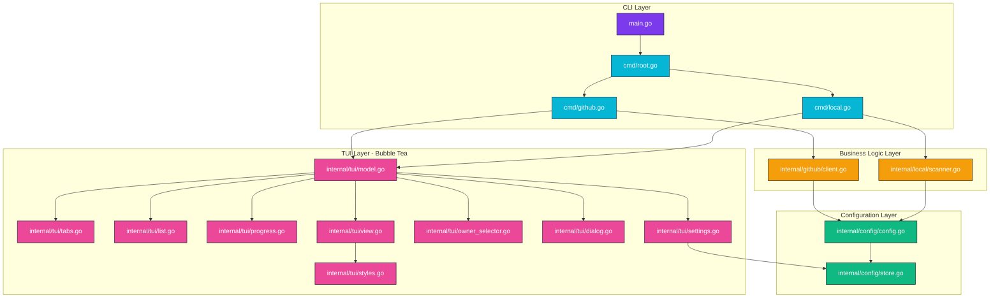

<!-- DO NOT TOUCH THIS SECTION#1: START -->
<h1 align="center">
   <br>
      repo-sync | Repository Synchronization Tool with Interactive TUI
   <br>

   <div align="center">
      <div align="center">
         <a href="https://github.com/MoshPitCodes/repo.sync/stargazers">
            
         </a>
         <a href="https://github.com/MoshPitCodes/repo.sync/">
            
         </a>
         <a href="https://github.com/MoshPitCodes/repo.sync/blob/main/LICENSE">
            
         </a>
         <a href="https://go.dev/">
            
         </a>
      </div>
      <br>
   </div>
</h1>

<br/>
<!-- DO NOT TOUCH THIS SECTION#1: END -->

# 🗃️ Overview

`repo-sync` is a modern Go CLI application that simplifies repository management by providing an elegant, interactive terminal user interface for synchronizing repositories. Whether you need to clone GitHub repositories or copy local repositories to a unified location, repo-sync makes it effortless with its intuitive TUI.

Built with Bubble Tea and following The Elm Architecture, repo-sync offers both interactive and batch modes for maximum flexibility. The interactive mode provides a rich terminal experience with tabs, search, sorting, and real-time progress tracking, while batch mode enables seamless automation in scripts and CI/CD pipelines.

### Key Features

- **Interactive TUI** - Beautiful terminal UI with multi-select, search, filtering, and sorting
- **GitHub Integration** - Seamless integration with GitHub via the `gh` CLI
  - Browse personal and organization repositories
  - Switch between multiple GitHub owners/orgs with owner selector
  - Automatic authentication using GitHub CLI
- **Local Repository Discovery** - Automatically scans configured directories for Git repositories
- **Batch Mode** - Non-interactive mode for automation and scripting
- **Persistent Configuration** - Settings stored in `~/.config/repo-sync/config.json`
- **Smart Conflict Handling** - Interactive dialog when repositories already exist
- **Tabbed Navigation** - Quick switching between Personal, Organizations, and Local modes
- **Progress Tracking** - Real-time inline progress with detailed sync results
- **Keyboard-Driven** - Comprehensive keyboard shortcuts for all actions
- **Idiomatic Go** - Built following Go 1.24+ best practices and patterns

<br/>

## 📚 Project Structure

[`cmd/`](cmd/) - CLI command definitions and entry points

[`internal/config/`](internal/config/) - Configuration management with persistent storage to `~/.config/repo-sync/config.json`

[`internal/github/`](internal/github/) - GitHub API client implementation using [go-gh](https://github.com/cli/go-gh)

[`internal/local/`](internal/local/) - Local filesystem scanner for discovering Git repositories

[`internal/tui/`](internal/tui/) - Bubble Tea TUI components including models, views, tabs, lists, progress bars, settings, owner selector, and dialogs

[`main.go`](main.go) - Application entry point

<br/>

## 📓 Project Components

| Component                      | Responsibility                                                                                           |
| ------------------------------ | :------------------------------------------------------------------------------------------------------- |
| **CLI Commands**               | Root command with TUI launcher, GitHub subcommand (interactive/batch), Local subcommand (interactive/batch) |
| **Configuration Management**   | Environment variable handling, persistent storage (`~/.config/repo-sync/config.json`), settings UI      |
| **GitHub Integration**         | API client using go-gh, repository listing, organization management, authentication via GitHub CLI      |
| **Local Scanner**              | Filesystem scanning for Git repositories, directory traversal, repository metadata extraction           |
| **TUI Framework**              | Bubble Tea model/view architecture, tab navigation, repository list view, multi-select functionality    |
| **TUI Components**             | Progress tracking, settings overlay, owner selector, conflict resolution dialog, keyboard shortcuts     |
| **Synchronization Engine**     | Git clone operations, local repository copying, conflict detection, progress reporting                  |

<br/>

# 📐 Architecture



### Detailed Structure

```
repo.sync/
├── cmd/
│   ├── root.go           # Root command and TUI launcher with tab support
│   ├── github.go         # GitHub subcommand (batch/interactive)
│   └── local.go          # Local subcommand (batch/interactive)
├── internal/
│   ├── config/
│   │   ├── config.go     # Configuration management and environment variables
│   │   └── store.go      # Persistent config storage (~/.config/repo-sync/config.json)
│   ├── github/
│   │   └── client.go     # GitHub API client (via go-gh)
│   ├── local/
│   │   └── scanner.go    # Local filesystem scanner for Git repositories
│   └── tui/
│       ├── model.go      # Main Bubble Tea model (state management)
│       ├── view.go       # View rendering logic
│       ├── tabs.go       # Tab bar (Personal/Organizations/Local)
│       ├── list.go       # Repository list view with selection
│       ├── progress.go   # Inline progress tracking during sync
│       ├── settings.go   # Settings overlay (config editor)
│       ├── owner_selector.go  # GitHub owner/org selector
│       ├── dialog.go     # Repository exists conflict dialog
│       ├── messages.go   # Bubble Tea messages (events)
│       ├── keymap.go     # Keyboard shortcuts and bindings
│       └── styles.go     # Lipgloss styles (colors, formatting)
├── main.go               # Application entry point
├── go.mod                # Go module definition
└── README.md             # This file
```

<br/>

# 🚀 **Installation**

> [!CAUTION]
> This tool will clone or copy Git repositories to your specified target directory. Ensure you review the configuration and understand the sync operations before executing them. While repo-sync includes conflict detection, you should backup important data before bulk synchronization operations.

> [!WARNING]
> You **must** have the GitHub CLI (`gh`) installed and authenticated to use GitHub synchronization features. Run `gh auth login` before using `repo-sync github` commands.

<br/>

## 1. **Prerequisites**

Before installing repo-sync, ensure you have the following dependencies:

- **Go 1.24 or later** - [Download](https://go.dev/dl/)
- **Git** - Version control system
- **GitHub CLI (`gh`)** - For GitHub synchronization (run `gh auth login` after installation)
- Authenticated GitHub account (for GitHub mode)

> [!NOTE]
> This tool has been tested with the following parameters:
> - Go 1.24+ on Linux, macOS, and Windows
> - GitHub CLI v2.40.0+
> - Git 2.40.0+

<br/>

## 2. **Installation Methods**

### Using Go Install (Recommended)

```bash
go install github.com/MoshPitCodes/repo.sync@latest
```

This will install the `repo-sync` binary to your `$GOPATH/bin` directory.

### Build from Source

```bash
# Clone the repository
git clone https://github.com/MoshPitCodes/repo.sync.git
cd repo.sync

# Build the binary
go build -o repo-sync

# Install globally (optional)
go install
```

### Building with Version Info

```bash
# Build with version information embedded
go build -ldflags "-X main.version=1.0.0" -o repo-sync

# Cross-compile for different platforms
GOOS=linux GOARCH=amd64 go build -o repo-sync-linux-amd64
GOOS=darwin GOARCH=amd64 go build -o repo-sync-darwin-amd64
GOOS=windows GOARCH=amd64 go build -o repo-sync-windows-amd64.exe
```

<br/>

## 3. **Configuration**

> [!TIP]
> You can configure repo-sync using environment variables, or interactively by pressing `c` in the TUI to open the settings panel.

### Environment Variables

Configure `repo-sync` using the following environment variables:

| Variable | Description | Default |
|----------|-------------|---------|
| `REPO_SYNC_TARGET_DIR` | Target directory for cloning/copying repositories | `~/repos` |
| `REPO_SYNC_GITHUB_OWNER` | Default GitHub owner/organization | Current user |
| `REPO_SYNC_SOURCE_DIRS` | Colon-separated list of directories to scan for local repos | None |

### Example Configuration

Add to your `~/.bashrc`, `~/.zshrc`, or equivalent:

```bash
# Target directory for synchronized repositories
export REPO_SYNC_TARGET_DIR="$HOME/projects"

# Default GitHub owner/organization
export REPO_SYNC_GITHUB_OWNER="MoshPitCodes"

# Directories to scan for local repositories (colon-separated)
export REPO_SYNC_SOURCE_DIRS="$HOME/dev:$HOME/work:$HOME/personal"
```

### Persistent Configuration

Settings are persisted to `~/.config/repo-sync/config.json` and include:

- Target directory for synchronized repositories
- Source directories for local repository scanning
- Default GitHub owner
- Recent owners list (for quick switching)
- UI preferences (compact mode, etc.)

<br/>

# 📝 **Usage**

## Quick Start

### Interactive Mode

Launch the interactive TUI menu with tabbed interface:

```bash
repo-sync
```

This launches a tabbed interface with three modes:
- **Personal (Tab 1)** - Browse your personal GitHub repositories
- **Organizations (Tab 2)** - Browse organization repositories
- **Local (Tab 3)** - Browse local Git repositories from configured directories

### GitHub Mode

Sync repositories from GitHub interactively:

```bash
# Launch GitHub mode (Personal tab by default)
repo-sync github

# Launch with specific owner/organization
repo-sync github --owner MoshPitCodes
```

Batch mode to clone specific repositories:

```bash
repo-sync github --owner MoshPitCodes --batch repo1 repo2 repo3
```

### Local Mode

Sync local repositories interactively:

```bash
repo-sync local
```

Batch mode to copy specific repositories:

```bash
repo-sync local --batch /path/to/repo1 /path/to/repo2
```

<br/>

## Command Reference

```bash
repo-sync                                         # Launch interactive TUI with tabs
repo-sync github                                  # GitHub interactive mode (Personal tab)
repo-sync github --owner <owner>                  # GitHub mode with specific owner
repo-sync github --owner <owner> --batch <repos...>  # Batch clone repos
repo-sync local                                   # Local interactive mode
repo-sync local --batch <paths...>                # Batch copy repos
```

<br/>

## Interactive Features

<details>
<summary>
<b>Tab Navigation</b> - Switch between Personal, Organizations, and Local modes
</summary>

- **Personal (1)**: View your personal GitHub repositories
- **Organizations (2)**: View organization repositories (use `o` to switch owners)
- **Local (3)**: View local repositories from configured directories
- **Switch Tabs**: Press `1`, `2`, or `3` to jump directly, or use `tab`/`shift+tab` to cycle

</details>

<details>
<summary>
<b>Repository List View</b> - Navigate, select, and manage repositories
</summary>

- **Navigation**: Use `↑`/`↓` or `k`/`j` to navigate, `pgup`/`pgdown` for page scrolling
- **Selection**: Press `space` to toggle selection of individual repositories
- **Select All**: Press `a` to select all repositories in the current list
- **Deselect All**: Press `n` to deselect all repositories
- **Search**: Press `/` to enter search/filter mode (real-time filtering)
- **Sort**: Press `s` to cycle through sort modes (name, updated, stars, size)
- **Owner**: Press `o` to open the owner selector (GitHub modes only)
- **Settings**: Press `c` to open configuration settings
- **Help**: Press `?` to view all keyboard shortcuts
- **Sync**: Press `enter` to start synchronization of selected repositories
- **Quit**: Press `q` or `ctrl+c` to exit

</details>

<details>
<summary>
<b>Search and Filter</b> - Real-time repository filtering
</summary>

- Type to filter repositories by name in real-time
- Filter applies immediately as you type
- Press `enter` or `esc` to exit search mode and return to normal navigation
- Search works across all tabs (Personal, Organizations, Local)

</details>

<br/>

## Examples

### Browse and Clone GitHub Repositories

```bash
# Launch the TUI
repo-sync

# In the TUI:
# 1. Press '1' for Personal repos or '2' for Organizations
# 2. Press 'o' to switch owner (if needed)
# 3. Use arrow keys or j/k to navigate
# 4. Press 'space' to select repositories
# 5. Press '/' to search/filter
# 6. Press 's' to change sort order
# 7. Press 'enter' to clone selected repositories
```

### Batch Clone Specific Repositories

```bash
# Clone multiple repositories from a specific owner
repo-sync github --owner MoshPitCodes --batch \
  repo.sync \
  moshpitcodes.template \
  moshpitcodes.nixos
```

### Discover and Copy Local Repositories

```bash
# Configure source directories (or set via Settings with 'c' in TUI)
export REPO_SYNC_SOURCE_DIRS="$HOME/dev:$HOME/projects"

# Launch the TUI
repo-sync

# In the TUI:
# 1. Press '3' to switch to Local tab
# 2. Browse discovered repositories from configured directories
# 3. Select repositories with 'space'
# 4. Press 'enter' to copy to target directory
```

### Batch Copy Local Repositories

```bash
# Copy specific local repositories to target directory
repo-sync local --batch \
  /home/user/dev/project1 \
  /home/user/dev/project2 \
  /home/user/work/project3
```

<br/>

# 🖼️ Gallery

<p align="center">
   Screenshots coming soon
   <br>
   <i>The interactive TUI with tabbed interface, repository selection, and real-time progress tracking</i>
</p>

<br/>

# 👥 Credits

Built with the following excellent libraries:

- [Bubble Tea](https://github.com/charmbracelet/bubbletea): Terminal UI framework based on The Elm Architecture
- [Bubbles](https://github.com/charmbracelet/bubbles): Reusable TUI components for Bubble Tea
- [Lipgloss](https://github.com/charmbracelet/lipgloss): Style definitions and rendering for terminal UIs
- [go-gh](https://github.com/cli/go-gh): Official GitHub CLI library for Go
- [Cobra](https://github.com/spf13/cobra): Modern CLI framework for Go

Special thanks to:

- [Charm](https://charm.sh/): For creating the amazing Bubble Tea ecosystem
- [GitHub CLI Team](https://cli.github.com/): For the official Go library

Other resources and inspiration:

- [The Elm Architecture](https://guide.elm-lang.org/architecture/): Architectural pattern used in Bubble Tea
- [Conventional Commits](https://www.conventionalcommits.org/): Commit message convention

<br/>

<!-- DO NOT TOUCH THIS SECTION#2: START -->
<!-- # ✨ Stars History -->

<br/>

<p align="center"></p>

<br/>

<p align="center"></p>

<!-- end of page, send back to the top -->

<div align="right">
  <a href="#readme">Back to the Top</a>
</div>
<!-- DO NOT TOUCH THIS SECTION#2: END -->
